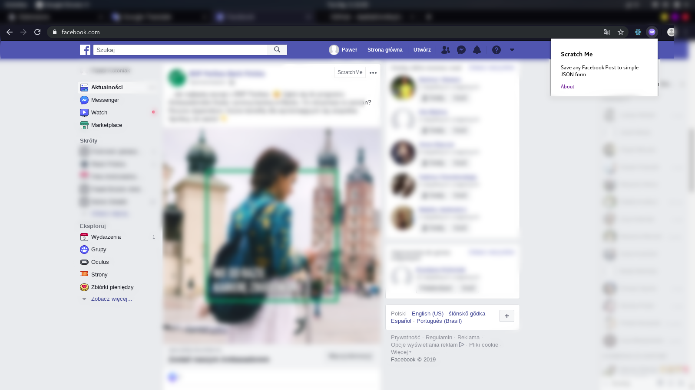

# scratchme-chrome-plugin
Save any Facebook Post to CRM.

## Description
Version 2.0 - form demo added

This is a Chrome extension that adds a button “ScratchMe” while scrolling to each Facebook post. 

After clicking the button, the data is taken from the post and displayed in the form. It is possible to display data in JSON and cURL formats.

## Installation

### The manual way

#### Chrome
1. Download the [package](https://github.com/bravelab/scratchme-chrome-plugin/archive/master.zip) and unzip it.
2. Go to Chrome extensions page (`chrome://extensions/`). Enable [Chrome Extensions Developer Mode](https://developer.chrome.com/extensions/faq#faq-dev-01) in Chrome and load the folder as an **Unpacked extension**.

## Screenshot


### Gitflow
Branches naming convention:
* **feat**: Branch with new functionalities
* **fix**: Branch with some fixes
* **hotfix**: Branch with urgent fixes (should be merged into develop and master)

Commit message prefix should be one of the following:

* **build**: Changes that affect the build system or external dependencies (example scopes: gulp, broccoli, npm)
* **ci**: Changes to our CI configuration files and scripts (example scopes: Circle, BrowserStack, SauceLabs)
* **docs**: Documentation only changes
* **feat**: A new feature
* **fix**: A bug fix
* **perf**: A code change that improves performance
* **refactor**: A code change that neither fixes a bug nor adds a feature
* **style**: Changes that do not affect the meaning of the code (white-space, formatting, missing semi-colons, etc)
* **test**: Adding missing tests or correcting existing tests

Example:
```shell
feat(auth-service): changing auth method
```
